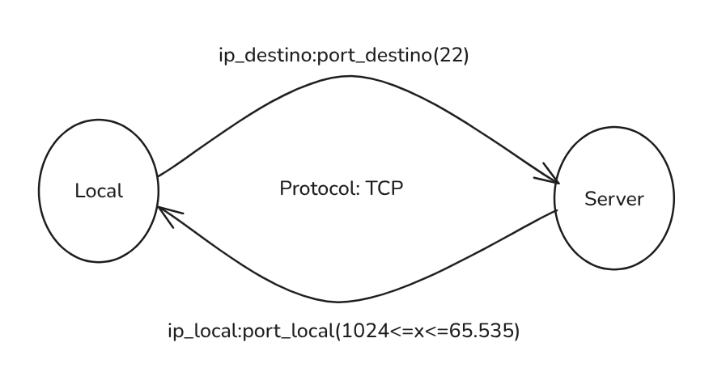

# Camadas e Protocolos de Comunicação em Computadores

## 1. Camadas de Comunicação

As camadas de rede seguem o modelo **simplificado**:

1. **Física**
2. **Ligação / Link**
3. **Rede**
4. **Transporte**
5. **Aplicação** //TCP/IP
5.1 **Sessão** //OSI
5.2 **Apresentação** //OSI

O modelo OSI (Open Systems Interconnection) possui 7 camadas, mas o modelo TCP/IP (mais utilizado) é uma versão simplificada com 5 camadas principais.

---

## 2. Camada de Transporte

A camada de transporte é responsável por garantir a entrega de dados entre aplicações.
Principais protocolos utilizados:

* **TCP (Transmission Control Protocol)** → orientado à conexão, confiável.
* **UDP (User Datagram Protocol)** → sem conexão, mais rápido, porém menos confiável.

### Cabeçalho

* **TCP:** 8 bytes
* **UDP:** 8 bytes

---

## 3. Portas

As portas permitem a identificação de serviços e aplicações dentro de um computador.
Um computador possui **16 bits para portas**, o que equivale a:

$
2^{16} = 65.536 \text{ portas (0 a 65.535)}
$

### Faixas de Portas

* **0 – 1023:** Well-known ports (reservadas para serviços do sistema).
* **1024 – 49151:** Portas registradas.
* **49152 – 65535:** Portas efêmeras ou dinâmicas.

🔗 Lista oficial de serviços e portas:
[Service Names and Port Numbers – IANA](https://www.iana.org/assignments/service-names-port-numbers/service-names-port-numbers.txt)

---

## 4. Segurança na Camada de Transporte

### TLS – Transport Layer Security

O **TLS** é um protocolo criptográfico utilizado para fornecer **segurança, privacidade e integridade** nas comunicações via internet.

* Usado em **transações financeiras**, **envio de informações pessoais** e **HTTPS**.
* Substituiu o antigo **SSL (Secure Sockets Layer)**.
* Considerado mais **seguro e eficiente** que seu antecessor.
