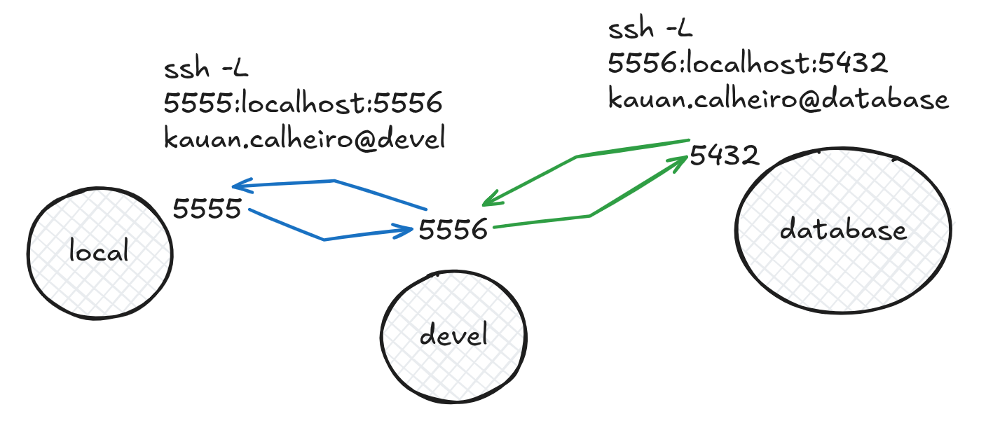

# SSH

SSH (Secure Shell) é um protocolo de rede que permite a comunicação segura entre dois computadores. Ele é amplamente utilizado para acessar servidores remotamente, transferir arquivos e executar comandos em sistemas remotos.

## Conexão via SSH

```bash
ssh user@host
```

## Montagem de sistema de arquivos remoto via SSHFS

SSHFS (SSH File System) permite montar um sistema de arquivos remoto via SSH.

```bash
sshfs user@host:/path/to/dir /local/mount/point
```

## Transferência de arquivos via SCP

O SCP (Secure Copy Protocol) é um meio de transferir arquivos entre um host local e um remoto de forma segura.

```bash
scp [source] [destination]

scp user@host:/path/to/remote/file /local/path

scp /local/path user@host:/path/to/remote/file
```

## Encaminhamento de portas via SSH

O encaminhamento de portas permite que você redirecione o tráfego de uma porta em sua máquina local para uma porta em um servidor remoto.

```bash
ssh -L [local_port]:[remote_host/localhost]:[remote_port] user@host

ssh -L 5555:localhost:5432 user@remote_host
```

Ex:

```
ssh -L 5555:localhost:5556 kauan.calheiro@devel
ssh -L 5556:localhost:5432 kauan.calheiro@database
```



## Gerar autenticação via chave pública

```bash
ssh-keygen -t [type] # Ex: rsa, ed25519

ssh-keygen -t ed25519 # Use defaults
ssh-copy-id user@host
```

## fail2ban

O fail2ban é uma ferramenta de segurança que monitora os logs do sistema em busca de tentativas de login falhadas e bloqueia temporariamente os endereços IP que excedem um número especificado de tentativas.

```bash
sudo apt install fail2ban
sudo systemctl start fail2ban
sudo systemctl enable fail2ban
sudo systemctl status fail2ban

sudo systemctl start fail2ban-client
sudo systemctl enable fail2ban-client
sudo systemctl status fail2ban-client
```

editar o ficheiro `/etc/fail2ban/jail.local` para configurar as definições de bloqueio.

```ini
[sshd]
enabled = true # ativar o serviço SSH
port = ssh # porta do serviço SSH
filter = sshd # filtro para o serviço SSH
logpath = /var/log/auth.log # caminho para o ficheiro de log
maxretry = 5 # número máximo de tentativas falhadas
bantime = 600 # tempo de bloqueio em segundos
findtime = 600 # tempo para contar as tentativas falhadas
```

### Check banned IPs

```bash
sudo iptables -L
```

### Unban IP

```bash
sudo fail2ban-client set sshd unbanip [IP_ADDRESS]
```