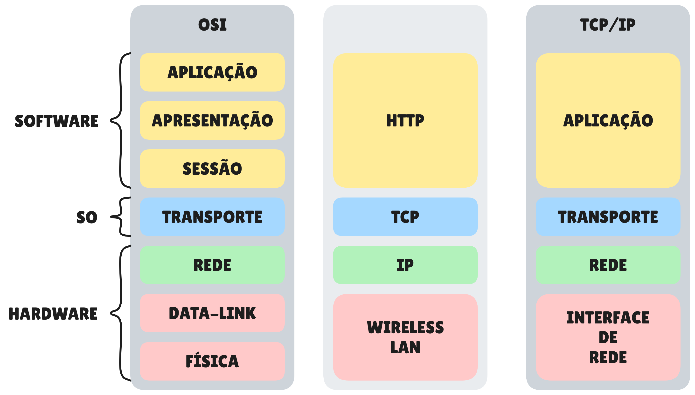
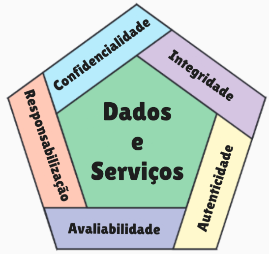

# **Segurança de Sistemas**

## **Camadas de Protocolo**

---

## **Camadas de Segurança**

1. **Segurança Física** – Proteção dos equipamentos e instalações contra acesso não autorizado, danos ou interferências.
2. **Segurança de Rede** – Proteção dos dados em trânsito através de redes, utilizando firewalls, VPNs e criptografia.
3. **Segurança de Sistema Operacional** – Implementação de políticas de segurança, controle de acesso e atualizações regulares.
4. **Segurança de Aplicações** – Desenvolvimento seguro de software, testes de vulnerabilidades e correção de falhas.
5. **Segurança de Dados** – Proteção dos dados armazenados, incluindo backup, criptografia e controle de acesso.

---

## **Ataque de Segurança**

Qualquer ação que comprometa a segurança da informação.

### **Ataques Passivos**

O atacante **não altera** o conteúdo; apenas observa o tráfego com o objetivo de obter informação.

- **Divulgação do Conteúdo da Mensagem** – Leitura direta de informações transmitidas.
- **Análise de Tráfego** – Observação de padrões como frequência, duração, origem e destino das mensagens; mesmo sem acessar o conteúdo, esses metadados podem revelar a natureza da comunicação.

### **Ataques Ativos**

O atacante **modifica**, **interfere** ou **insere** dados na comunicação.

- **Mascaramento (Mascarade)** – O atacante se faz passar por outra entidade legítima, assumindo sua identidade.

- **Repetição (Replay)** – Intercepta uma mensagem válida e a retransmite para causar efeitos não autorizados.

- **Modificação de Mensagem (Modification)** – Altera o conteúdo de uma mensagem legítima antes que ela chegue ao destino.

- **Negação de Serviço (DoS)** – Impede ou dificulta o uso normal de um serviço ou recurso, tornando-o indisponível.

---

## **Serviços de Segurança**

Serviços que reforçam a segurança de sistemas e comunicações utilizando mecanismos de segurança.

- **Confidencialidade** – Apenas partes autorizadas podem acessar a informação.

- **Integridade** – Garante que os dados não foram alterados.

- **Não Repúdio** – O emissor não pode negar a autoria da informação.

- **Disponibilidade** – A informação está acessível quando necessária.

- **Autenticação** – Verifica a identidade das partes envolvidas.

- **Controle de Acesso** – Permite apenas que usuários autorizados acessem recursos.

- **Responsabilização** – Permite rastrear ações até um usuário específico.

---

## **Mecanismos de Segurança**

São ferramentas técnicas e técnicas utilizadas para implementar serviços de segurança.

O mecanismo deve operar sozinho ou em conjunto com outros mecanismos para fornecer um ou mais serviços de segurança.

<!-- 22 -->

<!-- 1. What types of attacks are addressed by message authentication?
masquerade and modification of message

Types of atack
passive
active  2. What are some approaches to producing message authentication?
Using some secret key to apply some MAC, or some combination of hash with
HASH, MAC, HMAC and AE

3. When a combination of symmetric encryption and an error control code is used for message authentication, in what order must the two  be performed?
Better Encrypt-then-MAC
Better than this is to use AE

4. What is a message authentication code?
Is a way  to autenticate that message was not modified for someone listening the conversation.
It provides a confintiality

5. What is the difference between a message authentication code and a one-way hash function?
MAC needs a secret key to generate the code, hash function does not need any secret key.
f -->

<!-- AE -> Autenticated Encryption (use iv)

IV -> initialization vector (quando usado)
usado em file headers (not encripted)

AEAD -> Authenticated Encription with Associated Data
 -->
